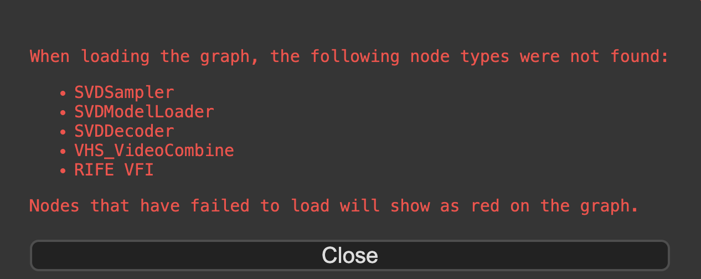

## Custom Nodes 支持

通常 ComfyUI 的用户会使用各种不同的 custom nodes 来构建自己的 workflow，在这过程中也会使用 [ComfyUI-Manager](https://github.com/ltdrdata/ComfyUI-Manager) 来方便地安装和管理自己的 custom nodes。

当前的 solution 要支持 custom nodes 只需要准备两样东西（如果你还不熟悉当前的 solution，建议先浏览一遍部署过程）：

1. 代码和环境：custom nodes 的代码放在 `$HOME/ComfyUI/custom_nodes` 下，环境通过 `pip install -r` 所有 custom nodes 目录下的 requirements.txt 来准备（如果有一些 custom nodes 的依赖冲突需要单独处理），同时安装一些 custom nodes 会用到的系统软件包。以上操作均通过 Dockerfile 来实现，构建一个包含了所需 custom nodes 的镜像。
2. 模型：custom nodes 用到的模型放到 `s3://comfyui-models-{account_id}-{region}` 下的不同目录即可，会触发 Lambda 给所有 GPU nodes 发送指令将新上传的模型同步到本地。


接下来以 [Stable Video Diffusion (SVD) - Image to video generation with high FPS](https://comfyworkflows.com/workflows/bf3b455d-ba13-4063-9ab7-ff1de0c9fa75) 这个 workflow 为例介绍如何支持 custom nodes（你也可以使用你自己的 workflow）


### 1. 构建镜像

当 load 这个 workflow 的时候会显示缺失的 custom nodes，我们接下来将会把缺失的 custom nodes 打进镜像中去

 

有两种方式构建镜像：

1. 从 Github 构建镜像：在 Dockerfile 中为每个 custom nodes 下载代码，并准备环境和依赖
2. 从本地构建镜像：将本地的 Dev 环境所有 custom nodes 都 COPY 到镜像中，并准备环境和依赖


构建镜像前请切换到对应 branch

```shell
git clone https://github.com/aws-samples/comfyui-on-eks ~/comfyui-on-eks
cd ~/comfyui-on-eks && git checkout custom_nodes_demo
```


#### 1.1 从 Github 构建镜像

通过在 Dockerfile 中使用 RUN 命令来安装 custom nodes 和依赖，需要先找到缺失的 custom nodes 的 Github 地址

```dockerfile
...
RUN apt-get update && apt-get install -y \
    git \
    python3.10 \
    python3-pip \
    # needed by custom node ComfyUI-VideoHelperSuite
    libsm6 \
    libgl1 \
    libglib2.0-0
...
# Custom nodes demo of https://comfyworkflows.com/workflows/bf3b455d-ba13-4063-9ab7-ff1de0c9fa75

## custom node ComfyUI-Stable-Video-Diffusion
RUN cd /app/ComfyUI/custom_nodes && git clone https://github.com/thecooltechguy/ComfyUI-Stable-Video-Diffusion.git && cd ComfyUI-Stable-Video-Diffusion/ && python3 install.py
## custom node ComfyUI-VideoHelperSuite
RUN cd /app/ComfyUI/custom_nodes && git clone https://github.com/Kosinkadink/ComfyUI-VideoHelperSuite.git && pip3 install -r ComfyUI-VideoHelperSuite/requirements.txt
## custom node ComfyUI-Frame-Interpolation
RUN cd /app/ComfyUI/custom_nodes && git clone https://github.com/Fannovel16/ComfyUI-Frame-Interpolation.git && cd ComfyUI-Frame-Interpolation/ && python3 install.py
...
```

完整 Dockerfile 参考 `comfyui-on-eks/comfyui_image/Dockerfile.github`

执行以下命令构建并上传 Docker image

```shell
region="us-west-2" # Modify the region to your current region.
cd ~/comfyui-on-eks/comfyui_image/ && bash build_and_push.sh $region Dockerfile.github
```

优点：

* 清楚了解每个 custom nodes 的安装方式、版本、环境依赖等，对整个 ComfyUI 环境更加可控

缺点：

* 当 custom nodes 数量太多时安装管理比较耗时，并且需要自己找到每个 custom node 的地址（另一方面说也是优点，对整个 ComfyUI 环境更加熟悉）


#### 1.2 从本地构建镜像 

很多时候我们通过 [ComfyUI-Manager](https://github.com/ltdrdata/ComfyUI-Manager) 来安装缺失的 custom nodes，ComfyUI-Manager 屏蔽了安装的细节，甚至我们也无法清楚知道安装了哪些 custome nodes，此时我们可以通过在 Dockerfile 中 COPY 整个 ComfyUI 目录（除去 input、output、models 等目录）来构建镜像

从本地构建镜像的前提是本地已经有可运行 custom nodes 的 ComfyUI 环境，在 ComfyUI 同级目录下创建 `.dockerignore` 文件，添加以下内容，在 build docker image 时 COPY 目录忽略以下目录内容

```
ComfyUI/models
ComfyUI/input
ComfyUI/output
ComfyUI/custom_nodes/ComfyUI-Manager
```

将 `comfyui-on-eks/comfyui_image/Dockerfile.local` 和 `comfyui-on-eks/comfyui_image/build_and_push.sh` 两个文件 `cp` 到本地 `ComfyUI` 的同级目录，如

```shell
ubuntu@comfyui:~$ ll
-rwxrwxr-x  1 ubuntu ubuntu       792 Jul 16 10:27 build_and_push.sh*
drwxrwxr-x 19 ubuntu ubuntu      4096 Jul 15 08:10 ComfyUI/
-rw-rw-r--  1 ubuntu ubuntu       784 Jul 16 10:41 Dockerfile.local
-rw-rw-r--  1 ubuntu ubuntu        81 Jul 16 10:45 .dockerignore
...
```

`Dockerfile.local` 中通过 COPY 的方式将代码 build 进 image

```dockerfile
...
# Python Evn
RUN pip3 install torch torchvision torchaudio --extra-index-url https://download.pytorch.org/whl/cu121
COPY ComfyUI /app/ComfyUI
RUN pip3 install -r /app/ComfyUI/requirements.txt

# Custom Nodes Env, may encounter some conflicts
RUN find /app/ComfyUI/custom_nodes -maxdepth 2 -name "requirements.txt"|xargs -I {} pip install -r {}
...
```

完整 Dockerfile 参考 `comfyui-on-eks/comfyui_image/Dockerfile.local`

执行以下命令构建并上传 Docker image

```shell
region="us-west-2" # Modify the region to your current region.
bash build_and_push.sh $region Dockerfile.local
```

优点：

* 可以很方便快速地将本地 Dev 环境 build 成镜像发布部署，当 custom nodes 很多时不需要关注 custom nodes 安装、版本和依赖的细节

缺点：

* 不关注 custom nodes 的部署环境可能会有冲突问题，以及依赖缺失问题，需要手动测试解决


### 2. 上传模型

用你熟悉的方法将 workflow 中需要的所有模型上传到 `s3://comfyui-models-{account_id}-{region}` 下对应目录即可，GPU nodes 会自动从 S3 同步（Lambda 触发），如果模型较大且数量较多则需要多等一段时间，可以通过 `aws ssm start-session --target ${instance_id}` 命令登录 GPU nodes，用 `ps` 命令查看 `aws s3 sync` 的同步进程。


### 3. 本地测试 docker image（可选，推荐）

由于 custom nodes 的种类很多，依赖和版本各不相同，运行环境比较复杂，建议在第1步 build 完 image 后，在本地测试 docker image 是否运行正常。

参考 `comfyui-on-eks/comfyui_image/test_docker_image_locally.sh` 这里的代码，准备好 models 和 input 目录（假设本地的 `/home/ubuntu/ComfyUI/models` 和 `/home/ubuntu/ComfyUI/input` 目录分别存放用到的模型和上传的图片），执行脚本运行 docker 进行测试

```shell
comfyui-on-eks/comfyui_image/test_docker_image_locally.sh
```


### 4. Rolling Update K8S pods

用你熟悉的方法 rolling update 线上的 K8S pods 的 image 后，对服务进行测试

 


---

其他部署步骤请参考 main 分支。
