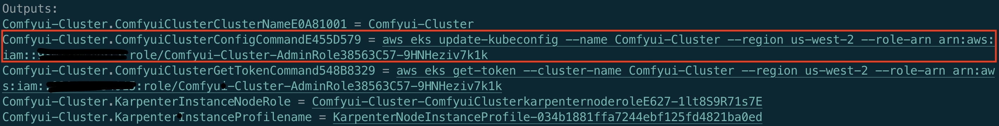

## Deploy Stable Diffusion on Amazon EKS elastically and efficiently


### 1. Background

As the most popular open-source AI image generation model today, Stable Diffusion has gained widespread adoption in the gaming industry. Its versatility shines in both ToC (Targeting Consumer) scenarios, engaging player communities, and ToB (Targeting Business) scenarios, enhancing art production in game studios. The effective use of Stable Diffusion has sparked considerable interest. The community has actively contributed various runtimes for Stable Diffusion. Notable examples include [stable-diffusion-webui](https://github.com/AUTOMATIC1111/stable-diffusion-webui), [ComfyUI](https://github.com/comfyanonymous/ComfyUI), and [Fooocus](https://github.com/lllyasviel/Fooocus). Furthermore, there're also a lot of solutions for the deployment, management of Stable Diffusion image generation platforms. This article will focus on ComfyUI, demonstrating how to deploy a Stable Diffusion image generation platform on AWS, specifically for art teams.


### 2. ComfyUI Introduction

ComfyUI is an open-source, node-based workflow solution for Stable Diffusion. It deconstructs the various processes of the Stable Diffusion model into distinct nodes. This approach not only provides users with a clearer understanding of how Stable Diffusion works but also allows for more precise control over the entire process. Although ComfyUI has a steeper learning curve, it offers several advantages over other Stable Diffusion runtimes:

1. Significant performance optimization in SDXL model inference compared to other interfaces, with image generation speeds improving by 10% to 25% over other runtimes.
2. High customizability enables users to control the image generation process more accurately and in finer detail. Advanced users can generate better-quality images more easily with ComfyUI.
3. Workflows, which can be shared as JSON or image files, facilitate easier dissemination and improved efficiency.
4. Developer-friendly, with workflow API calls that can be made in any programming language by simply loading JSON files in the same API format.

Due to these advantages, ComfyUI is increasingly being adopted by art creators.


### 3. Solution Features

The solution is characterized by the following features:

1. **Infrastructure as Code (IaC) Deployment**: We employ a minimalist approach to operations and maintenance. Using [AWS Cloud Development Kit (AWS CDK)](https://aws.amazon.com/cdk/) and [Amazon EKS Blueprints](https://aws-quickstart.github.io/cdk-eks-blueprints/), we manage the [Amazon Elastic Kubernetes Service (Amazon EKS)](https://aws.amazon.com/eks/) clusters that host and run ComfyUI.
2. **Dynamic Scaling with Karpenter**: Leveraging the capabilities of [Karpenter](https://karpenter.sh/), we customize node scaling strategies to meet business needs.
3. **Cost Savings with Amazon Spot Instances**: We utilize [Amazon Spot instances](https://aws.amazon.com/ec2/spot/) to reduce the costs of GPU instances.
4. **Optimized Use of GPU Instance Store**: By fully utilizing the [instance store](https://docs.aws.amazon.com/AWSEC2/latest/UserGuide/InstanceStorage.html) of GPU instances, we maximize performance for model loading and switching while minimizing the costs associated with model storage and transfer.
5. **Direct Image Writing with S3 CSI Driver**: Images generated are directly written to [Amazon S3](https://aws.amazon.com/s3/) using the [S3 CSI driver](https://docs.aws.amazon.com/eks/latest/userguide/s3-csi.html), reducing storage costs.
6. **Accelerated Dynamic Requests with Amazon CloudFront**: To facilitate the use of the platform by art studios across different regions, we use [Amazon CloudFront](https://aws.amazon.com/cloudfront/) for faster dynamic request processing.
7. **Serverless Event-Triggered Model Synchronization**: When models are uploaded to or deleted from S3, serverless event triggers activate, syncing the model directory data across worker nodes.


### 4. Solution Architecture


The solution's architecture is structured into two distinct phases: the deployment phase and the user interaction phase.

**Deployment Phase**

1. **Model Storage in S3**: ComfyUI's models are stored in **S3 for models**, following the same directory structure as the native `ComfyUI/models` directory.
2. **GPU Node Initialization in EKS Cluster**: When GPU nodes in the EKS cluster are initiated, they format the local Instance store and synchronize the models from S3 to the local Instance store using user-data scripts.
3. **Running ComfyUI Pods in EKS**: Pods operating ComfyUI effectively link the Instance store directory on the node to the pod's internal models directory, facilitating seamless model access and loading.
4. **Model Sync with Lambda Trigger**: When models are uploaded to or deleted from S3, a Lambda function is triggered to synchronize the models from S3 to the local Instance store on all GPU nodes via SSM commands.
5. **Output Mapping to S3**: Pods running ComfyUI map the `ComfyUI/output` directory to **S3 for outputs** with PVC (Persistent Volume Claim) methods.


**User Interaction Phase**

1. **Request Routing**: When a user request reaches the EKS pod through CloudFront --> ALB, the pod first loads the model from the Instance store.
2. **Image Storage Post-Inference**: After inference, the pod stores the image in the `ComfyUI/output` directory, which is directly written to S3 using the S3 CSI driver.
3. **Performance Advantages of Instance Store**: Thanks to the performance benefits of the Instance store, the time taken for initial model loading and model switching is significantly reduced.

You can find the deployment code with following address, for detailed deployment instructions, please refer to Section 6.

```shell
https://github.com/aws-samples/comfyui-on-eks
```


### 5. Image Generation

Once deployed, you can access and use the ComfyUI frontend directly through a browser by visiting the domain name of CloudFront or the domain name of Kubernetes Ingress.


You can also interact with ComfyUI by saving its workflow as a JSON file that's callable via an API. This method facilitates better integration with your own platforms and systems. For reference on how to make these calls, see the code in `comfyui-on-eks/test/invoke_comfyui_api.py`.


### 6. Deployment Instructions

#### 6.1 Prerequisites

This solution assumes that you have already installed, deployed, and are familiar with the following tools:

* [AWS CLI](https://docs.aws.amazon.com/cli/latest/userguide/getting-started-install.html): latest version
* [eksctl](https://eksctl.io/installation/)
* [kubectl](https://kubernetes.io/docs/tasks/tools/)
* [Docker](https://docs.docker.com/engine/install/)
* [npm](https://docs.npmjs.com/downloading-and-installing-node-js-and-npm/)
* [CDK](https://docs.aws.amazon.com/cdk/v2/guide/getting_started.html): latest version


Make sure that you have enough vCPU quota for G instances. (At least 8 vCPU for a g5.2xl/g4dn.2x used in this guidance)


Download the code, **checkout the branch, install rpm packages, and check the environment**

```shell
git clone https://github.com/aws-samples/comfyui-on-eks ~/comfyui-on-eks
cd ~/comfyui-on-eks && git checkout v0.2.0
npm install
npm list
cdk list
```

Run `npm list` to ensure following packages are installed

```
comfyui-on-eks@0.1.0 ~/comfyui-on-eks
├── @aws-quickstart/eks-blueprints@1.14.1
├── aws-cdk-lib@2.133.0
├── aws-cdk@2.133.0
└── ...
```

Run `cdk list` to ensure the environment is all set, you will have following CloudFormation stack to deploy

```
Comfyui-Cluster
CloudFrontEntry
LambdaModelsSync
S3OutputsStorage
ComfyuiEcrRepo
```

#### 6.2 Deploy EKS Cluster

Run the following command

```shell
cd ~/comfyui-on-eks && cdk deploy Comfyui-Cluster 
```

CloudFormation will create a stack named `Comfyui-Cluster` to deploy all the resources required for the EKS Cluster. This process typically takes around 20 to 30 minutes to complete.

The configuration details for the `Comfyui-Cluster Stack` can be explored in the file `comfyui-on-eks/lib/comfyui-on-eks-stack.ts`. Essential elements to focus on are as follows:

1. The EKS cluster is constructed using the EKS Blueprints framework, `blueprints.EksBlueprint.builder()`.
2. A selection of Addons from EKS Blueprints are installed for the EKS cluster:
   - `AwsLoadBalancerControllerAddOn`: Manages the Kubernetes ingress ALB.
   - `SSMAgentAddOn`: Enables the use of SSM on EKS nodes for remote login or command execution.
   - `Karpenter`: Facilitates the scaling of EKS nodes.
   - `GpuOperatorAddon`: Supports the operation of GPU nodes.
3. S3 permissions are added to the EKS nodes to enable the synchronization of model files from S3 to the local instance store.
4. Rather than specifying a nodegroup for GPU instances, we establish a nodegroup with CPU instances dedicated to lightweight applications, which facilitates the operation of Addon pods. The management and scaling of GPU instances are exclusively handled by Karpenter.

Upon successful deployment, the CDK outputs will present a `ConfigCommand`. This command is used to update the configuration, enabling access to the EKS cluster via kubectl.



**Execute the above ConfigCommand to authorize kubectl to access the EKS cluster**

To verify that kubectl has been granted access to the EKS cluster, execute the following command:

```shell
kubectl get svc
```

Now, the deployment of the EKS cluster is complete.

Also, note that EKS Blueprints has outputted `KarpenterInstanceNodeRole`, which is the role for the nodes managed by Karpenter. Please record this role, as it will be configured in section 6.5.2.


#### 6.3 Deploy an S3 bucket for storing models and set up Lambda for dynamic model synchronization

Run the following command:

```shell
cd ~/comfyui-on-eks && cdk deploy LambdaModelsSync
```

The `LambdaModelsSync` stack primarily creates the following resources:

* S3 bucket: The S3 bucket is named following the format `comfyui-models-{account_id}-{region}`, it's used to store ComfyUI models.
* Lambda function, along with its associated role and event source: The Lambda function, named `comfy-models-sync`, is designed to trigger the synchronization of models from the S3 bucket to local storage on GPU instances whenever models are uploaded to or deleted from S3.

Essential details in the `LambdaModelsSync` resource configuration, located in `comfyui-on-eks/lib/lambda-models-sync.ts`, include:

1. The code for the Lambda function is located in `comfyui-on-eks/lib/ComfyModelsSyncLambda/model_sync.py`.
2. The Lambda is used to filter all GPU instances within the ComfyUI EKS Cluster using tags, when create or remove events occur in the S3 bucket storing models, it uses SSM to command all GPU instances to synchronize the models from S3 to their local directories (instance store).


Once the S3 for Models and Lambda are deployed, the S3 bucket will initially be empty. Execute the following command to initialize the S3 bucket and download the SDXL model for testing purposes.

Note: **The following command will download the SDXL model to your local machine and upload it to S3. Ensure you have enough disk space (20GB). Alternatively, you can upload the model to the corresponding S3 directory using your preferred method.**

```shell
region="us-west-2" # Modify the region to your current region.
cd ~/comfyui-on-eks/test/ && bash init_s3_for_models.sh $region
```

There's no need to wait for the model to finish downloading and uploading to S3. You can proceed with the following steps, just ensure the model is uploaded to S3 before starting the GPU nodes.


#### 6.4 Deploy S3 bucket for storing images generated by ComfyUI.

Run the following command

```shell
cd ~/comfyui-on-eks && cdk deploy S3OutputsStorage
```


The `S3OutputsStorage` stack just creates a S3 bucket, named following the pattern `comfyui-outputs-{account_id}-{region}`, which is used to store images generated by ComfyUI.


#### 6.5 Deploy ComfyUI Workload

The ComfyUI workload is deployed through Kubernetes. Please follow the steps below.

##### 6.5.1 Build and Push ComfyUI Docker Image

Run the following command, create an ECR repo for ComfyUI image

```shell
cd ~/comfyui-on-eks && cdk deploy ComfyuiEcrRepo
```


Run the `build_and_push.sh` script on a machine where Docker has been successfully installed.

```shell
region="us-west-2" # Modify the region to your current region.
cd ~/comfyui-on-eks/comfyui_image/ && bash build_and_push.sh $region
```


For the ComfyUI Docker image, refer to `comfyui-on-eks/comfyui_image/Dockerfile`, keeping the following points in mind:

1. The Dockerfile uses a combination of git clone and git checkout to pin a specific version of ComfyUI. Modify this as needed.
2. The Dockerfile does not install customer nodes, these can be added as needed using the RUN command.
3. You only need to rebuild the image and replace it with the new version to update ComfyUI.

After building the image, execute the following command to ensure the image's architecture is X86, as the GPU instances used in this solution are all based on X86 models.

```shell
region="us-west-2" # Modify the region to your current region.
ACCOUNT_ID=$(aws sts get-caller-identity --query Account --output text)
image_name=${ACCOUNT_ID}.dkr.ecr.${region}.amazonaws.com/comfyui-images:latest
docker image inspect $image_name|grep Architecture
```


##### 6.5.2 Deploy Karpenter for Managing GPU Instance Scaling

Get the KarpenterInstanceNodeRole in Section 6.2 and run the following command to deploy Karpenter:

**Run on Linux**

```shell
KarpenterInstanceNodeRole="Comfyui-Cluster-ComfyuiClusterkarpenternoderoleE627-juyEInBqoNtU" # Modify the role to your own.
sed -i "s/role: KarpenterInstanceNodeRole.*/role: $KarpenterInstanceNodeRole/g" comfyui-on-eks/manifests/Karpenter/karpenter_v1beta1.yaml
kubectl apply -f comfyui-on-eks/manifests/Karpenter/karpenter_v1beta1.yaml
```

**Run on MacOS**

```shell
KarpenterInstanceNodeRole="Comfyui-Cluster-ComfyuiClusterkarpenternoderoleE627-juyEInBqoNtU" # Modify the role to your own.
sed -i '' "s/role: KarpenterInstanceNodeRole.*/role: $KarpenterInstanceNodeRole/g" comfyui-on-eks/manifests/Karpenter/karpenter_v1beta1.yaml
kubectl apply -f comfyui-on-eks/manifests/Karpenter/karpenter_v1beta1.yaml
```

To verify the deployment of Karpenter, use this command:

```shell
kubectl describe karpenter
```

Key considerations for Karpenter's deployment: 

1. We use both g5.2xlarge and g4dn.2xlarge instances, along with both `on-demand` and `spot` instances.
2. Initialization of GPU instances launched by Karpenter in userData:
   1. Formatting the instance store local disk and mounting it to the `/comfyui-models` directory.
   2. Synchronizing model files stored on S3 to the local instance store.

The KarpenterInstanceNodeRole needs an additional S3 access permission to allow GPU nodes to sync files from S3. Execute the following command:

```shell
KarpenterInstanceNodeRole="Comfyui-Cluster-ComfyuiClusterkarpenternoderoleE627-juyEInBqoNtU" # Modify the role to your own.
aws iam attach-role-policy --policy-arn arn:aws:iam::aws:policy/AmazonS3FullAccess --role-name $KarpenterInstanceNodeRole
```


##### 6.5.3 Deploy S3 PV and PVC to store generated images

Execute the following command to deploy the PV and PVC for S3 CSI.

**Run on Linux**

```shell
region="us-west-2" # Modify the region to your current region.
account=$(aws sts get-caller-identity --query Account --output text)
sed -i "s/region .*/region $region/g" comfyui-on-eks/manifests/PersistentVolume/sd-outputs-s3.yaml
sed -i "s/bucketName: .*/bucketName: comfyui-outputs-$account-$region/g" comfyui-on-eks/manifests/PersistentVolume/sd-outputs-s3.yaml
kubectl apply -f comfyui-on-eks/manifests/PersistentVolume/sd-outputs-s3.yaml
```

**Run on MacOS**

```shell
region="us-west-2" # Modify the region to your current region.
account=$(aws sts get-caller-identity --query Account --output text)
sed -i '' "s/region .*/region $region/g" comfyui-on-eks/manifests/PersistentVolume/sd-outputs-s3.yaml
sed -i '' "s/bucketName: .*/bucketName: comfyui-outputs-$account-$region/g" comfyui-on-eks/manifests/PersistentVolume/sd-outputs-s3.yaml
kubectl apply -f comfyui-on-eks/manifests/PersistentVolume/sd-outputs-s3.yaml
```


##### 6.5.4 Deploy EKS S3 CSI Driver

Run the following command to add your IAM principal to EKS cluster

```shell
identity=$(aws sts get-caller-identity --query 'Arn' --output text --no-cli-pager)
aws eks update-cluster-config --name Comfyui-Cluster --access-config authenticationMode=API_AND_CONFIG_MAP
aws eks create-access-entry --cluster-name Comfyui-Cluster --principal-arn $identity --type STANDARD --username comfyui-user
aws eks associate-access-policy --cluster-name Comfyui-Cluster --principal-arn $identity --access-scope type=cluster --policy-arn arn:aws:eks::aws:cluster-access-policy/AmazonEKSAdminPolicy
```

Run the following command to ensure that your IAM principal has been added

```shell
aws eks list-access-entries --cluster-name Comfyui-Cluster|grep $identity
```


Execute the following command to create a role and service account for the S3 CSI driver, enabling it to read and write to S3.

```shell
region="us-west-2" # Modify the region to your current region.
account=$(aws sts get-caller-identity --query Account --output text)
ROLE_NAME=EKS-S3-CSI-DriverRole-$account-$region
POLICY_ARN=arn:aws:iam::aws:policy/AmazonS3FullAccess
eksctl create iamserviceaccount \
    --name s3-csi-driver-sa \
    --namespace kube-system \
    --cluster Comfyui-Cluster \
    --attach-policy-arn $POLICY_ARN \
    --approve \
    --role-name $ROLE_NAME \
    --region $region
```


Run the following command to install  `aws-mountpoint-s3-csi-driver` Addon

```shell
region="us-west-2" # Modify the region to your current region.
account=$(aws sts get-caller-identity --query Account --output text)
eksctl create addon --name aws-mountpoint-s3-csi-driver --version v1.0.0-eksbuild.1 --cluster Comfyui-Cluster --service-account-role-arn "arn:aws:iam::${account}:role/EKS-S3-CSI-DriverRole-${account}-${region}" --force
```


##### 6.5.5 Deploy ComfyUI Deployment and Service

Run the following command to replace docker image

**Run on Linux**

```shell
region="us-west-2" # Modify the region to your current region.
account=$(aws sts get-caller-identity --query Account --output text)
sed -i "s/image: .*/image: ${account}.dkr.ecr.${region}.amazonaws.com\/comfyui-images:latest/g" comfyui-on-eks/manifests/ComfyUI/comfyui_deployment.yaml
```

**Run on MacOS**

```shell
region="us-west-2" # Modify the region to your current region.
account=$(aws sts get-caller-identity --query Account --output text)
sed -i '' "s/image: .*/image: ${account}.dkr.ecr.${region}.amazonaws.com\/comfyui-images:latest/g" comfyui-on-eks/manifests/ComfyUI/comfyui_deployment.yaml
```

Run the following command to deploy ComfyUI Deployment and Service

```shell
kubectl apply -f comfyui-on-eks/manifests/ComfyUI
```

A few points to note about ComfyUI Deployment and Service:

1. ComfyUI pod scaling time depends on the instance type, if there are insufficient nodes, Karpenter will need to provision nodes for initialization before pods get scheduled, once images sync, pods become schedulable. You can check Kubernetes events and Karpenter logs with following command:

   ```shell
   podName=$(kubectl get pods -n karpenter|tail -1|awk '{print $1}')
   kubectl logs -f $podName -n karpenter
   ```

   ```shell
   kubectl get events --watch
   ```

   If you see  ERROR log like following

   ```
   AuthFailure.ServiceLinkedRoleCreationNotPermitted: The provided credentials do not have permission to create the service-linked role for EC2 Spot Instances.
   ```

   You need to create a service linked role

   ```shell
   aws iam create-service-linked-role --aws-service-name spot.amazonaws.com
   ```

   

2. Different GPU instance types have different Instance Store sizes.  If the total model size in S3 exceeds the Instance Store size, you'll need to use other method to manage model storage.


When ComfyUI pod is running, execute the following command to check the log:

```shell
podName=$(kubectl get pods |tail -1|awk '{print $1}')
kubectl logs -f $podName
```


#### 6.6 Test ComfyUI on EKS

##### 6.6.1 API Test

Test with API, run the following command in the `comfyui-on-eks/test` directory:

**Run on Linux**

```shell
ingress_address=$(kubectl get ingress|grep comfyui-ingress|awk '{print $4}')
sed -i "s/SERVER_ADDRESS = .*/SERVER_ADDRESS = \"${ingress_address}\"/g" invoke_comfyui_api.py
sed -i "s/HTTPS = .*/HTTPS = False/g" invoke_comfyui_api.py
sed -i "s/SHOW_IMAGES = .*/SHOW_IMAGES = False/g" invoke_comfyui_api.py
./invoke_comfyui_api.py
```

**Run on MacOS**

```shell
ingress_address=$(kubectl get ingress|grep comfyui-ingress|awk '{print $4}')
sed -i '' "s/SERVER_ADDRESS = .*/SERVER_ADDRESS = \"${ingress_address}\"/g" invoke_comfyui_api.py
sed -i '' "s/HTTPS = .*/HTTPS = False/g" invoke_comfyui_api.py
sed -i '' "s/SHOW_IMAGES = .*/SHOW_IMAGES = False/g" invoke_comfyui_api.py
./invoke_comfyui_api.py
```

Refer to `comfyui-on-eks/test/invoke_comfyui_api.py` for the API call logic. Note the following points:

1. The API call executes the ComfyUI workflow stored in `comfyui-on-eks/test/sdxl_refiner_prompt_api.json`. 
2. Two models are used: sd_xl_base_1.0.safetensors and sd_xl_refiner_1.0.safetensors.
3. You can modify the prompt in sdxl_refiner_prompt_api.json or invoke_comfyui_api.py to test different inputs.


##### 6.6.2 Test with browser

Run the following command to get the K8S ingress address:

```shell
kubectl get ingress
```

Access the ingress address through a web browser.


The deployment and testing of ComfyUI on EKS is now complete. Next we will connect the EKS cluster to CloudFront for edge acceleration.


#### 6.6 Deploy CloudFront for edge acceleration (Optional)

Execute the following command in the `comfyui-on-eks` directory to connect the Kubernetes ingress to CloudFront:

```shell
cdk deploy CloudFrontEntry
```

The `CloudFrontEntry` stack can be referenced in `comfyui-on-eks/lib/cloudfront-entry.ts`. Pay attention to the following:

1. The EKS Ingress ALB is found by tag.
2. The EKS Ingress ALB is set as the CloudFront Distribution origin.
3. The ComfyUI ALB ingress is only configured for HTTP, so the CloudFront Origin Protocol Policy is set to HTTP_ONLY.  
4. Caching is disabled for dynamic requests by setting the cache policy to CACHING_DISABLED.


After deployment completes, Outputs will be printed including the CloudFront URL `CloudFrontEntry.cloudFrontEntryUrl`. Refer to section 6.6 for testing via the API or browser.


### 7. Delete All Resources

Run the following command to delete all Kubernetes resources:

```shell
kubectl delete -f comfyui-on-eks/manifests/ComfyUI/
kubectl delete -f comfyui-on-eks/manifests/PersistentVolume/
kubectl delete -f comfyui-on-eks/manifests/Karpenter/
```


Run the following command to delete all deployed resources:

```shell
aws ecr batch-delete-image --repository-name comfyui-images --image-ids imageTag=latest
cdk destroy ComfyuiEcrRepo
cdk destroy CloudFrontEntry
cdk destroy S3OutputsStorage
cdk destroy LambdaModelsSync
cdk destroy Comfyui-Cluster
```


### 8. Summary

This article introduces a solution for deploying ComfyUI on EKS. By combining instance store and S3, it maximizes model loading and switching performance while reducing storage costs. It also automatically syncs models in a serverless way, leverages spot instances to lower GPU instance costs, and accelerates globally via CloudFront to meet the needs of geographically distributed art studios. The entire solution manages underlying infrastructure as code to minimize operational overhead.

