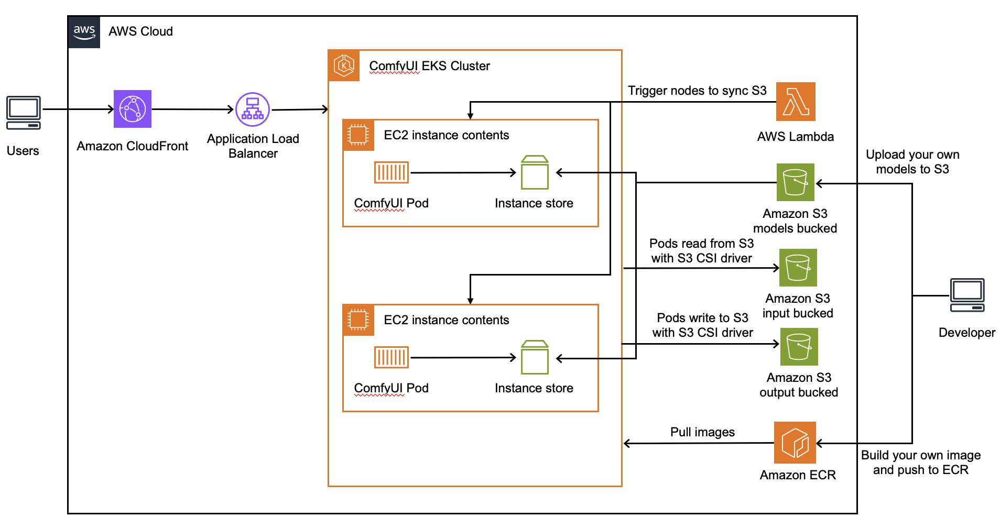
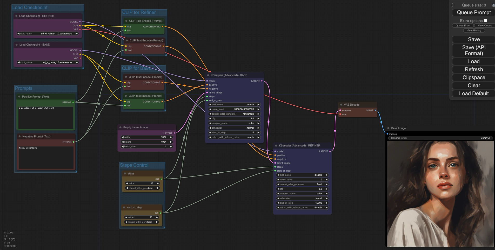
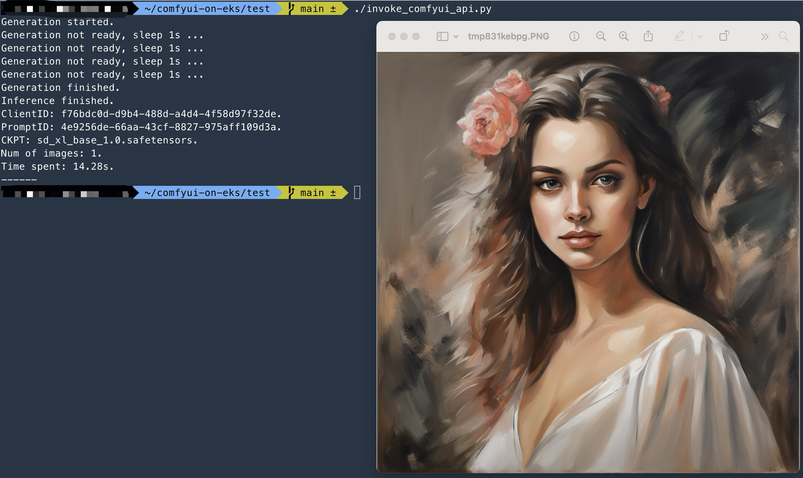
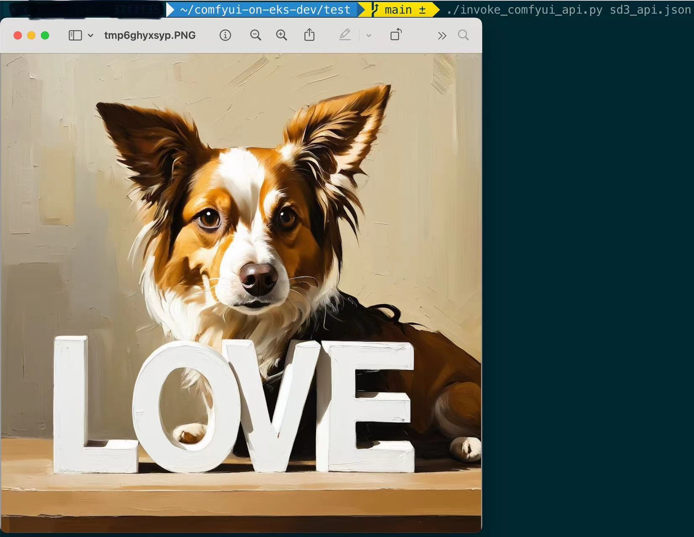

[简体中文](./README.zh.md)

## What's this

It's a solution to deploy ComfyUI on Amazon EKS.

## Solution Features

1. **Infrastructure as Code (IaC) Deployment**: We employ a minimalist approach to operations and maintenance. Using [AWS Cloud Development Kit (AWS CDK)](https://aws.amazon.com/cdk/) and [Amazon EKS Blueprints](https://aws-quickstart.github.io/cdk-eks-blueprints/), we manage the [Amazon Elastic Kubernetes Service (Amazon EKS)](https://aws.amazon.com/eks/) clusters that host and run ComfyUI.
2. **Dynamic Scaling with Karpenter**: Leveraging the capabilities of [Karpenter](https://karpenter.sh/), we customize node scaling strategies to meet business needs.
3. **Cost Savings with Amazon Spot Instances**: We utilize [Amazon Spot instances](https://aws.amazon.com/ec2/spot/) to reduce the costs of GPU instances.
4. **Optimized Use of GPU Instance Store**: By fully utilizing the [instance store](https://docs.aws.amazon.com/AWSEC2/latest/UserGuide/InstanceStorage.html) of GPU instances, we maximize performance for model loading and switching while minimizing the costs associated with model storage and transfer.
5. **Direct Image Writing with S3 CSI Driver**: Images generated are directly written to [Amazon S3](https://aws.amazon.com/s3/) using the [S3 CSI driver](https://docs.aws.amazon.com/eks/latest/userguide/s3-csi.html), reducing storage costs.
6. **Accelerated Dynamic Requests with Amazon CloudFront**: To facilitate the use of the platform by art studios across different regions, we use [Amazon CloudFront](https://aws.amazon.com/cloudfront/) for faster dynamic request processing.
7. **Serverless Event-Triggered Model Synchronization**: When models are uploaded to or deleted from S3, serverless event triggers activate, syncing the model directory data across worker nodes.

## Security Considerations

Before proceeding with the deployment, please note the following important security considerations:

1. **Network Access Control**:
   - The Application Load Balancer (ALB) in this solution is configured for internal access only
   - Client applications need to establish proper network connectivity to access the service
   - Appropriate security group configurations are required for successful communication

2. **Access Security Recommendations**:
   - It is strongly recommended to implement your own authentication layer in front of the ALB
   - Consider implementing solutions such as:
     - AWS Cognito for user authentication
     - API Gateway with custom authorizers
     - Your organization's existing authentication system
   - Implement proper IAM roles and policies for service access

3. **Network Requirements**:
   - Ensure VPC peering or Transit Gateway is configured if accessing from different VPCs
   - Configure security groups to allow traffic only from trusted sources
   - Consider using AWS PrivateLink for enhanced security

## Solution Architecture



The solution's architecture is structured into two distinct phases: the deployment phase and the user interaction phase.

**Deployment Phase**

1. **Model Storage in S3**: ComfyUI's models are stored in **S3 for models**, following the same directory structure as the native `ComfyUI/models` directory.
2. **GPU Node Initialization in EKS Cluster**: When GPU nodes in the EKS cluster are initiated, they format the local Instance store and synchronize the models from S3 to the local Instance store using user-data scripts.
3. **Running ComfyUI Pods in EKS**: Pods operating ComfyUI effectively link the Instance store directory on the node to the pod's internal models directory, facilitating seamless model access and loading.
4. **Model Sync with Lambda Trigger**: When models are uploaded to or deleted from S3, a Lambda function is triggered to synchronize the models from S3 to the local Instance store on all GPU nodes via SSM commands.
5. **Output Mapping to S3**: Pods running ComfyUI map the `ComfyUI/output` directory to **S3 for outputs** with PVC (Persistent Volume Claim) methods.


**User Interaction Phase**

1. **Request Routing**: When a user request reaches the EKS pod through CloudFront --> ALB, the pod first loads the model from the Instance store.
2. **Image Storage Post-Inference**: After inference, the pod stores the image in the `ComfyUI/output` directory, which is directly written to S3 using the S3 CSI driver.
3. **Performance Advantages of Instance Store**: Thanks to the performance benefits of the Instance store, the time taken for initial model loading and model switching is significantly reduced.

## Image Generation Demo

Once deployed, you can access and use the ComfyUI frontend directly through a browser by visiting the domain name of CloudFront or the domain name of Kubernetes Ingress.



You can also interact with ComfyUI by saving its workflow as a JSON file that's callable via an API. This method facilitates better integration with your own platforms and systems. For reference on how to make these calls, see the code in `comfyui-on-eks/test/invoke_comfyui_api.py`.



## Deployment Instructions

You can refer to [detailed instructions](./archive_docs/deployment_instructions_details.en.md) to deploy, or run following automatic deployment scripts on Ubuntu (with larger than 50GB disk space for docker image and models).

### 1. Prerequisites

Make sure that you have enough vCPU quota for G instances. (At least 8 vCPU for a g6.2x/g5.2x/g4dn.2x or 4 vCPU for a g6e.x used in this guidance)

```shell
rm -rf ~/comfyui-on-eks && git clone https://github.com/aws-samples/comfyui-on-eks ~/comfyui-on-eks
cd ~/comfyui-on-eks && git checkout stable
region="us-west-2" # Modify the region to your current region
project="" # [Optional] Default is empty, you can modify the project name to your own
if [[ x$project == 'x' ]]
then
	project_dir="$HOME/comfyui-on-eks"
else
	mv $HOME/comfyui-on-eks $HOME/comfyui-on-eks-$project
	project_dir="$HOME/comfyui-on-eks-$project"
fi
sed -i "s/export AWS_DEFAULT_REGION=.*/export AWS_DEFAULT_REGION=$region/g" $project_dir/auto_deploy/env.sh
sed -i "s/export PROJECT_NAME=.*/export PROJECT_NAME=$project/g" $project_dir/auto_deploy/env.sh
cd $project_dir
```

Install needed tools and npm libs by running

```shell
cd $project_dir/auto_deploy/ && bash env_prepare.sh
```

### 2. Deploy

Deploy all resources by running

```shell
source ~/.bashrc && cd $project_dir/auto_deploy/ && bash deploy_infra.sh
```

### 3. Delete all resources

Delete all resources by running

```shell
cd $project_dir/auto_deploy/ && bash destroy_infra.sh
```

## Cost Analysis

Assuming the following scenario:

* Deploying 1 g5.2xlarge instance for image generation
* Generating a 1024x1024 image takes average 9 seconds, with average size of 1.5MB
* Daily usage time is 8 hours, with 20 days of usage per month
* The number of images that can be generated per month is 8 x 20 x 3600 / 9 = 64000
* The total size of images to be stored each month is 64000 x 1.5MB / 1000 = 96GB
* DTO traffic size is approximately 100GB (96GB + HTTP requests)
* ComfyUI images of different versions total 20GB

The total cost of deploying this solution in us-west-2 is approximately **$441.878 (using CloudFront for external access) or $442.378 (using ALB for external access)**

| Service                                | Pricing | Detail                                                       |
| -------------------------------------- | ------- | ------------------------------------------------------------ |
| Amazon EKS (Control Plane)             | $73     | Fixed Pricing                                                |
| Amazon EC2 (ComfyUI-EKS-GPU-Node)      | $193.92 | 1 g5.2xlarge instance (On-Demand)<br />1 x $1.212/h x 8h x 20days/month |
| Amazon EC2 (Comfyui-EKS-LW-Node)       | $137.68 | 2 t3a.xlarge instance (1yr RI No upfront since it's fixed long running)<br />2 x $68.84/month |
| Amazon S3 (Standard) for models        | $2.3    | Total models size 100GB x $0.023/GB                          |
| Amazon S3 (Standard) for output images | $2.208  | 64000 images/month x 1.5MB/image / 1000 x $0.023/GB<br />Rotate all images per month |
| Amazon ECR                             | $2      | 20GB different versions of images x $0.1/GB                  |
| AWS ALB                                | $22.27  | 1 ALB $16.43 fixed hourly charges<br />+<br />$0.008/LCU/h x 730h x 1LCU x 1ALB |
| DTO (use ALB)                          | $9      | 100GB x $0.09/GB                                             |
| DTO (use CloudFront)                   | $8.5    | 100GB x $0.085/GB                                            |

## Change logs

### Automatic Deployment -- 2024.12.26

Automatic deployment scripts in `comfyui-on-eks/auto_deploy/`, only support Ubuntu now.

### Flux Support

ComfyUI has already supported Flux, to use Flux with this solution you only need to:

1. Build docker image with the latest version of ComfyUI (Already done in [Dockerfile](https://github.com/aws-samples/comfyui-on-eks/blob/main/comfyui_image/Dockerfile))
2. Download and put Flux models to the corresponding S3 directory. [ComfyUI Flux Examples](https://comfyanonymous.github.io/ComfyUI_examples/flux/)

Use comfyui flux workflow to invoke, just refer to `comfyui-on-eks/test/` folder.

### Custom Nodes Support

Switch to branch [custom_nodes_demo](https://github.com/aws-samples/comfyui-on-eks/tree/custom_nodes_demo) for details.

### Stable Diffusion 3 Support

ComfyUI has already supported Stable Diffusion 3, to use Stable Diffusion 3 with this solution you only need to:

1. Build docker image with the latest version of ComfyUI
2. Download and put SD3 models to the corresponding S3 directory. [ComfyUI SD3 Examples](https://comfyanonymous.github.io/ComfyUI_examples/sd3/)

Use comfyui sd3 workflow to invoke, just refer to `comfyui-on-eks/test/` folder.



