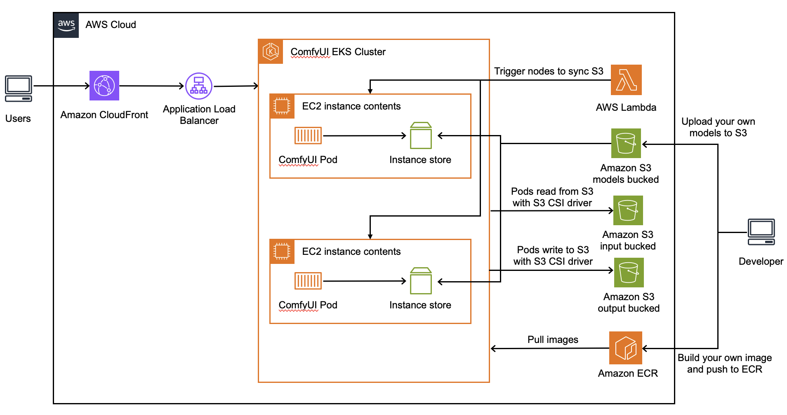
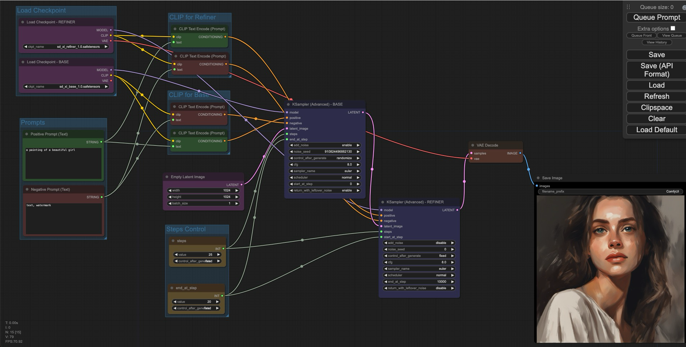
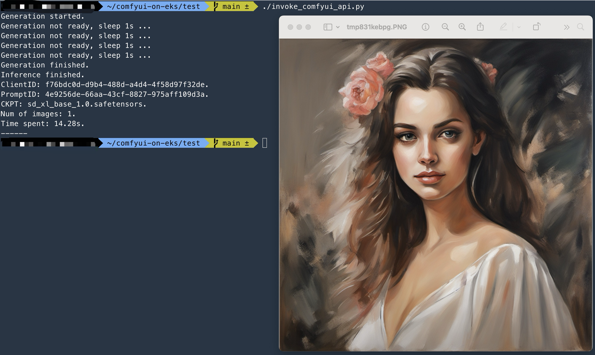

## What's this

A solution to deploy [ComfyUI](https://github.com/comfyanonymous/ComfyUI) on Amazon EKS with GPU acceleration, auto-scaling, and secure external access via CloudFront.

## Solution Features

1. **Infrastructure as Code (IaC) Deployment**: Using [AWS CDK](https://aws.amazon.com/cdk/) and [Amazon EKS Blueprints](https://aws-quickstart.github.io/cdk-eks-blueprints/) to manage the [Amazon EKS](https://aws.amazon.com/eks/) cluster that hosts ComfyUI.
2. **Dynamic Scaling with Karpenter**: [Karpenter](https://karpenter.sh/) v1.3 provisions GPU nodes on demand, scaling to zero when idle.
3. **Cost Savings with Amazon Spot Instances**: [Amazon Spot instances](https://aws.amazon.com/ec2/spot/) reduce GPU instance costs (g6.2xlarge / g5.2xlarge).
4. **Optimized Use of GPU Instance Store**: Models are synced to local [instance store](https://docs.aws.amazon.com/AWSEC2/latest/UserGuide/InstanceStorage.html) NVMe for fast loading and switching.
5. **Direct Image Writing with S3 CSI Driver**: Generated images are written directly to [Amazon S3](https://aws.amazon.com/s3/) using [Mountpoint for S3 CSI driver](https://docs.aws.amazon.com/eks/latest/userguide/s3-csi.html) v2.5.
6. **Secure Access via CloudFront VPC Origins**: [Amazon CloudFront](https://aws.amazon.com/cloudfront/) connects to the internal ALB via [VPC Origins](https://docs.aws.amazon.com/AmazonCloudFront/latest/DeveloperGuide/private-content-vpc-origins.html) — the ALB is never exposed to the internet.
7. **Serverless Event-Triggered Model Synchronization**: S3 events trigger a Lambda function to sync model files across all GPU nodes via SSM.
8. **CodeBuild for Builds and Model Downloads**: Container images and model downloads run on [AWS CodeBuild](https://aws.amazon.com/codebuild/) — no local Docker, GPU, disk space, or bandwidth required. Models download at 200+ MiB/s directly from HuggingFace to S3.
9. **Amazon Bedrock Integration**: Built-in custom nodes for [Amazon Bedrock](https://aws.amazon.com/bedrock/) — text-to-image (Nova Canvas), text-to-video (Nova Reel), upscaling/inpainting (Stability AI), prompt enhancement (Claude, Nova, Qwen3), and image understanding (vision models).

## Security Considerations

1. **Network Access Control**:
   - The ALB is configured as **internal only** and is not reachable from the internet
   - CloudFront accesses the ALB through VPC Origins (AWS PrivateLink — traffic never traverses the public internet)
   - All resources are deployed in private subnets with NAT gateway egress
   - Kubernetes NetworkPolicy restricts pod ingress to ALB subnets only (port 8848) and limits egress to DNS + HTTPS

2. **IAM and Least Privilege**:
   - All IAM roles use scoped inline policies with specific resource ARN patterns (no wildcards except where AWS APIs require them)
   - Bedrock access is scoped to the deployment region only
   - S3 model sync uses checksum verification (`--checksum-mode ENABLED`)
   - Node IMDSv2 enforced with hop limit of 1 (containers cannot reach node metadata)

3. **Supply Chain Security**:
   - All npm dependencies pinned to exact versions with vulnerability overrides
   - Dockerfile pins ComfyUI and Florence2 to immutable commit SHAs
   - External tool downloads (eksctl, kubectl) use SHA256 checksum verification
   - Container images scanned on push via ECR image scanning
   - Weekly automated image rebuilds pick up OS security patches

4. **Access Security Recommendations** (not included by default — add for production):
   - Implement authentication in front of CloudFront (e.g., AWS WAF, Cognito, Lambda@Edge)
   - Restrict CloudFront access with signed URLs or cookies
   - For end-to-end TLS (CloudFront → ALB), add ACM Private CA and HTTPS listener on the ALB

5. **Resource Tagging**:
   - All AWS resources are tagged with `Project: comfyui-on-eks` via CDK global tags
   - Kubernetes resources use the label `project: comfyui-on-eks`

## Solution Architecture



The solution's architecture is structured into two distinct phases: the deployment phase and the user interaction phase.

**Deployment Phase**

1. **Model Storage in S3**: ComfyUI's models are stored in **S3 for models**, following the same directory structure as the native `ComfyUI/models` directory.
2. **GPU Node Initialization in EKS Cluster**: When GPU nodes in the EKS cluster are initiated, they format the local Instance store and synchronize the models from S3 to the local Instance store using user-data scripts.
3. **Running ComfyUI Pods in EKS**: Pods operating ComfyUI effectively link the Instance store directory on the node to the pod's internal models directory, facilitating seamless model access and loading.
4. **Model Sync with Lambda Trigger**: When models are uploaded to or deleted from S3, a Lambda function is triggered to synchronize the models from S3 to the local Instance store on all GPU nodes via SSM commands.
5. **Output Mapping to S3**: Pods running ComfyUI map the `ComfyUI/output` directory to **S3 for outputs** with PVC (Persistent Volume Claim) methods.


**User Interaction Phase**

1. **Request Routing**: When a user request reaches the EKS pod through CloudFront --> ALB, the pod first loads the model from the Instance store.
2. **Image Storage Post-Inference**: After inference, the pod stores the image in the `ComfyUI/output` directory, which is directly written to S3 using the S3 CSI driver.
3. **Performance Advantages of Instance Store**: Thanks to the performance benefits of the Instance store, the time taken for initial model loading and model switching is significantly reduced.

## Image Generation Demo

Once deployed, you can access and use the ComfyUI frontend directly through a browser by visiting the domain name of CloudFront or the domain name of Kubernetes Ingress.



You can also interact with ComfyUI by saving its workflow as a JSON file that's callable via an API. This method facilitates better integration with your own platforms and systems. For reference on how to make these calls, see the code in `comfyui-on-eks/test/invoke_comfyui_api.py`.



## Amazon Bedrock Integration

This solution includes custom ComfyUI nodes that connect to [Amazon Bedrock](https://aws.amazon.com/bedrock/) foundation models, enabling cloud-powered image generation, video generation, editing, upscaling, and LLM-based prompt enhancement — all without managing model infrastructure.

The nodes communicate with Bedrock via EKS Pod Identity. The deploy script automatically creates a role with an IAM policy granting `bedrock:InvokeModel`, `bedrock:InvokeModelWithResponseStream`, `bedrock:StartAsyncInvoke`, and `bedrock:GetAsyncInvoke` permissions (scoped to the deployment region). No API keys or manual configuration are needed inside ComfyUI.

### Available Nodes

| Node | Category | Description | Use Case |
|------|----------|-------------|----------|
| **Bedrock Text (Converse)** | Bedrock | Text generation via Converse API | Prompt enhancement, creative writing |
| **Bedrock Vision (Converse)** | Bedrock | Image+text understanding via Converse API | Image captioning, scene analysis |
| **Bedrock Nova Canvas** | Bedrock/Nova Canvas | Image generation and editing | Text-to-image, inpaint, outpaint, background removal, variations |
| **Bedrock Nova Reel (Video)** | Bedrock/Nova Reel | Text/image-to-video generation | Short video clips with camera motion control |
| **Bedrock Stability Inpaint** | Bedrock/Stability | Mask-based inpainting | Fill masked regions with generated content |
| **Bedrock Stability Remove Background** | Bedrock/Stability | Background removal | Extract subjects from images |
| **Bedrock Stability Upscale** | Bedrock/Stability | Image upscaling (fast/conservative/creative) | Enhance resolution |
| **Bedrock Stability Control** | Bedrock/Stability | Structure/sketch-guided generation | ControlNet-style depth/edge-guided output |
| **Bedrock Stability Search & Replace** | Bedrock/Stability | Text-guided object replacement | Replace objects by description |
| **Bedrock Stability Style Transfer** | Bedrock/Stability | Apply style from reference image | Transfer artistic style |

### Supported Models

> For a complete list of all Bedrock nodes, models, and parameters, see the [Bedrock Nodes README](comfyui_image/custom_nodes/comfyui-bedrock/README.md).

**Text/Vision (Converse API)** — accessible via the "Bedrock Text (Converse)" and "Bedrock Vision (Converse)" nodes:

| Provider | Model ID | Type |
|----------|----------|------|
| Amazon | `us.amazon.nova-lite-v1:0`, `us.amazon.nova-pro-v1:0`, `us.amazon.nova-micro-v1:0` | Text + Vision |
| Anthropic | `us.anthropic.claude-opus-4-7`, `us.anthropic.claude-sonnet-4-6`, `us.anthropic.claude-haiku-4-5-20251001-v1:0` | Text + Vision |
| DeepSeek | `us.deepseek.r1-v1:0` | Text |
| Meta | `us.meta.llama4-scout-17b-instruct-v1:0`, `us.meta.llama4-maverick-17b-instruct-v1:0`, `us.meta.llama3-3-70b-instruct-v1:0` | Text + Vision |
| Mistral | `mistral.mistral-large-3-675b-instruct`, `us.mistral.pixtral-large-2502-v1:0` | Text + Vision |
| Google | `google.gemma-3-27b-it`, `google.gemma-3-12b-it` | Vision |
| Qwen | `qwen.qwen3-235b-a22b-2507-v1:0`, `qwen.qwen3-32b-v1:0`, `qwen.qwen3-vl-235b-a22b` | Text + Vision |

**Image Generation/Editing (InvokeModel API)**

| Model ID | Provider | Capability |
|----------|----------|------------|
| `amazon.nova-canvas-v1:0` | Amazon | Text-to-image, inpaint, outpaint, background removal, variations |
| `stability.stable-image-inpaint-v1:0` | Stability AI | Inpainting |
| `stability.stable-image-remove-background-v1:0` | Stability AI | Background removal |
| `stability.stable-image-fast-upscale-v1:0` | Stability AI | Fast upscaling |
| `stability.stable-image-conservative-upscale-v1:0` | Stability AI | Conservative upscaling |
| `stability.stable-image-creative-upscale-v1:0` | Stability AI | Creative upscaling |
| `stability.stable-image-control-structure-v1:0` | Stability AI | Depth/edge-guided generation |
| `stability.stable-image-control-sketch-v1:0` | Stability AI | Sketch-guided generation |
| `stability.stable-image-search-and-replace-v1:0` | Stability AI | Object replacement |
| `stability.stable-image-style-transfer-v1:0` | Stability AI | Style transfer |

**Video Generation (StartAsyncInvoke API)**

| Model ID | Provider | Capability |
|----------|----------|------------|
| `amazon.nova-reel-v1:0` | Amazon | Text-to-video, image-to-video (6s clips, 1280x720, 24fps) |

### How Bedrock Access Works

1. During deployment, `deploy_infra.sh` creates an IAM role with an inline policy (`BedrockInvokeAccess`) scoped to the deployment region:
   ```json
   {
     "Effect": "Allow",
     "Action": ["bedrock:InvokeModel", "bedrock:InvokeModelWithResponseStream", "bedrock:StartAsyncInvoke", "bedrock:GetAsyncInvoke"],
     "Resource": [
       "arn:aws:bedrock:<REGION>::foundation-model/*",
       "arn:aws:bedrock:<REGION>:<ACCOUNT>:inference-profile/*"
     ]
   }
   ```
2. The role is associated with the ComfyUI service account via EKS Pod Identity
3. ComfyUI pods inherit this permission automatically — no credentials or environment variables needed
4. The custom nodes use `boto3` to call Bedrock APIs directly from within the pod

### Prerequisites

1. Enable the desired model access in the [Bedrock console](https://console.aws.amazon.com/bedrock/home#/modelaccess) (Nova, Stability AI, Claude, and/or Qwen)
2. For Nova Reel: provide an S3 bucket for video output (the node writes async results to S3)
3. The deploy script handles all IAM configuration automatically

### Example Workflows

**Prompt Enhancement** — Use the Bedrock Text node with Claude or Nova Lite:
1. Connect a simple text prompt (e.g., "a cat in a garden")
2. Set system prompt to "Enhance this prompt for Stable Diffusion with rich visual details"
3. Connect the output text to the positive prompt of a KSampler node

**Cloud Image Generation** — Use the Nova Canvas node:
1. Enter a text prompt describing the desired image
2. Set width/height and cfg_scale
3. Connect the output IMAGE to a preview or save node

**Upscaling** — Use the Stability Upscale node:
1. Connect any IMAGE output from your workflow
2. Select upscale mode (fast, conservative, or creative)
3. Connect the upscaled IMAGE to a save node

**Video Generation** — Use the Nova Reel node:
1. Enter a text prompt describing the video scene
2. Optionally connect an IMAGE as the first frame
3. Provide an S3 bucket/prefix for the output video
4. The node returns the S3 URI of the generated .mp4 file (6 seconds, 1280x720, 24fps)

## Deployment Instructions

### Prerequisites

- AWS account with sufficient vCPU quota for G instances (at least 8 vCPU for g6.2xlarge/g5.2xlarge)
- Ubuntu instance with 50GB+ disk space (for automated deployment), or macOS for local CDK operations
- AWS CLI configured with appropriate permissions

### 1. Clone and prepare

```shell
git clone https://github.com/aws-samples/comfyui-on-eks ~/comfyui-on-eks
cd ~/comfyui-on-eks
```

To deploy in a different region, edit `auto_deploy/env.sh`:
```shell
export AWS_DEFAULT_REGION="us-west-2"  # Change to your target region
```

To use a non-default AWS profile:
```shell
export AWS_PROFILE=your-profile-name
```

### 2. Install dependencies

```shell
cd ~/comfyui-on-eks/auto_deploy/ && bash env_prepare.sh
```

This installs AWS CLI, eksctl, kubectl, Node.js, CDK CLI, and npm packages.

### 3. Deploy

```shell
source ~/.bashrc && cd ~/comfyui-on-eks/auto_deploy/ && bash deploy_infra.sh
```

This deploys all stacks in order:

1. EKS cluster
2. Lambda (model sync)
3. S3 buckets
4. ECR + CodeBuild projects
5. **Tier 1 model download** (blocks until essential models are in S3)
6. **Full model download** (runs in background via CodeBuild)
7. Container image build (CodeBuild)
8. Karpenter node pool
9. S3 PV/PVC
10. S3 CSI driver
11. ComfyUI deployment
12. CloudFront distribution

### 4. Access

After deployment, access ComfyUI via the CloudFront URL output by the `ComfyUI-on-EKS-CloudFront` stack.

### 5. Delete all resources

```shell
cd ~/comfyui-on-eks/auto_deploy/ && bash destroy_infra.sh
```

## Model Management

### How Models Are Loaded

Models are downloaded from HuggingFace and stored in S3 using a dedicated [AWS CodeBuild](https://aws.amazon.com/codebuild/) project (`comfyui-model-download`). This approach has several advantages over downloading locally:

- **Fast**: CodeBuild runs inside AWS with direct network path to both HuggingFace and S3 (200+ MiB/s)
- **No local resources**: No local disk space or bandwidth required
- **Reliable**: Built-in retries, up to 4-hour timeout, and skip-if-exists logic
- **Tiered**: Essential models (Tier 1) download first to unblock deployment; remaining models download in background

### Deployment Flow

```
deploy_infra.sh
    |
    |--> cdk_deploy_ecr()           # Creates CodeBuild projects
    |--> upload_models_to_s3_tier1() # Triggers CodeBuild (tier1) - BLOCKS
    |       Downloads: z_image_turbo, qwen_3_4b, ae.safetensors, RealESRGAN
    |       (~15 GB, takes ~2 minutes)
    |
    |--> upload_models_to_s3_all()   # Triggers CodeBuild (all) - BACKGROUND
    |       Downloads: SD 1.5/XL, Flux, Qwen Image, Wan 2.2, ACE Step, etc.
    |       (~130 GB, takes ~30 minutes)
    |
    |--> deploy_comfyui()            # Pod starts with Tier 1 models ready
```

### Included Models (~38 files, ~130 GB)

| Category | Models | Used By |
|----------|--------|---------|
| **diffusion_models/** | z_image_turbo, flux1-dev-fp8, qwen_image, qwen_image_edit, wan2.2 (i2v high/low noise), acestep_v1.5_turbo, lotus-depth | Templates 01-05, Flux, Qwen, Wan |
| **text_encoders/** | qwen_3_4b, clip_l, t5xxl_fp16, qwen_2.5_vl_7b, umt5_xxl, qwen_0.6b/4b_ace15 | All workflows |
| **checkpoints/** | SD 1.5, SDXL base/refiner, DreamShaper 8, SD2 inpainting, SD2.1, SVD, hunyuan_3d_v2.1 | Archived + 3D workflows |
| **vae/** | ae, vae-ft-mse, qwen_image_vae, wan_2.1_vae, ace_1.5_vae | All workflows |
| **controlnet/** | scribble, openpose, depth (SD1.5 fp16) | Archived ControlNet workflows |
| **upscale_models/** | RealESRGAN_x4plus | Image upscale workflows |
| **loras/** | Qwen Lightning, Wan 2.2 lightx2v, Qwen Edit Lightning | Speed up Qwen/Wan workflows |
| **model_patches/** | Z-Image-Turbo-Fun-Controlnet-Union | ControlNet for z_image_turbo |

### Adding Custom Models

To add your own models after deployment:

```shell
# The S3 models bucket (comfyui-models-<ACCOUNT>-<REGION>) is created automatically
# by the CDK deployment. Upload follows ComfyUI/models directory structure:
aws s3 cp my-model.safetensors s3://comfyui-models-<ACCOUNT>-<REGION>/checkpoints/

# The Lambda trigger automatically syncs to GPU nodes via SSM
# Or trigger a manual download via CodeBuild:
cd test/ && bash download_models_codebuild.sh <region> <profile> all
```

### Re-running Model Downloads

If you need to re-download models (e.g., after adding new entries to `buildspec_models.yml`):

```shell
cd ~/comfyui-on-eks/test
bash download_models_codebuild.sh us-west-2 default all
```

The CodeBuild job skips models that already exist in S3, so re-runs are safe and only download missing files.

### On-Demand Model Downloads (Auto Model Downloader)

Beyond the pre-loaded models, the solution includes an **auto-download extension** that transparently fetches missing models when a workflow needs them. This means the full catalog of ~90 models is available on demand without pre-loading everything.

**How it works:**

1. User loads any workflow template and clicks "Queue Prompt"
2. The extension intercepts the prompt, scans for model file references
3. If models are missing, it shows a download progress notification in the UI
4. Models are downloaded from S3 (or HuggingFace as fallback) to the local instance store
5. Dependencies (text encoders, VAEs) are automatically co-downloaded
6. Once all models are present, the workflow executes automatically

**User experience:** No new nodes to learn, no manual intervention. Workflows that reference models not yet on disk simply take longer on first run, then work instantly on subsequent runs.

**Supported model catalog** (~90 models across 20+ capability groups):

| Group | Capability | Models |
|-------|-----------|--------|
| `z_image_turbo` | Fast text-to-image | z_image_turbo + qwen_3_4b + ae VAE |
| `flux1_dev` | High-quality text-to-image | flux1-dev-fp8 + clip_l + t5xxl |
| `flux2_dev` | Instruction-based editing | flux2 + mistral_3_small + decoder |
| `qwen_image` | Qwen text-to-image | qwen_image + qwen_2.5_vl + vae |
| `qwen_image_edit` | Qwen instruction editing | qwen_image_edit + encoder + vae |
| `wan22_i2v` | Image-to-video | Wan 2.2 14B i2v (high/low noise) |
| `wan22_t2v` | Text-to-video | Wan 2.2 14B t2v (high/low noise) |
| `wan21_vace` | Video inpainting | Wan 2.1 VACE 14B |
| `ltx23` | LTX video gen + upscale | LTX 2.3 22B + gemma + spatial upscaler |
| `ltx2_controlnet` | Video ControlNet | LTX 2.0 + canny/depth/pose LoRAs |
| `ace_step` | Audio generation | ACE Step 1.5 turbo |
| `capybara` | HunyuanImage | Capybara + qwen_2.5_vl + sigclip |
| `hunyuan_3d` | 3D model generation | Hunyuan 3D v2.1 |
| `sd15` | SD 1.5 workflows | SD 1.5 + DreamShaper + MSE VAE |
| `sdxl` | SDXL workflows | SDXL Base + Refiner |

The catalog is defined in `comfyui_image/custom_nodes/comfyui-auto-model-downloader/model_catalog.json` and can be extended by adding new entries.

## Component Versions

| Component | Version |
|-----------|---------|
| Amazon EKS | 1.35 |
| Karpenter | 1.9.0 |
| NVIDIA GPU Operator | v26.3.2 (driver/toolkit from AMI) |
| ComfyUI | v0.21.1 |
| PyTorch | 2.12.0 (CUDA 13.0) |
| Mountpoint S3 CSI Driver | v2.5.0 |
| AWS CDK | 2.260.0 (CLI 2.1128.0) |
| EKS Blueprints | 1.18.2 |
| Node AMI | AL2023 GPU (driver 580+) |

## Cost Analysis

> Cost estimates based on AWS on-demand pricing in us-west-2 as of June 2026. See [EC2 pricing](https://aws.amazon.com/ec2/pricing/on-demand/) and [EKS pricing](https://aws.amazon.com/eks/pricing/) for current rates.

Assuming the following scenario:

* Deploying 1 g5.2xlarge instance for image generation
* Generating a 1024x1024 image takes average 9 seconds, with average size of 1.5MB
* Daily usage time is 8 hours, with 20 days of usage per month
* The number of images that can be generated per month is 8 x 20 x 3600 / 9 = 64000
* The total size of images to be stored each month is 64000 x 1.5MB / 1000 = 96GB
* DTO traffic size is approximately 100GB (96GB + HTTP requests)
* ComfyUI images of different versions total 20GB

The total cost of deploying this solution in us-west-2 is approximately **$450/month** (varies by instance pricing):

| Service | Pricing | Detail |
| --- | --- | --- |
| Amazon EKS (Control Plane) | $73 | Fixed Pricing |
| Amazon EC2 (GPU Node) | $193.92 | 1 g5.2xlarge (On-Demand), 8h/day x 20 days |
| Amazon EC2 (System Nodes) | $137.68 | 2 t3a.xlarge (1yr RI No Upfront) |
| Amazon S3 (models) | $2.3 | 100GB x $0.023/GB |
| Amazon S3 (outputs) | $2.21 | ~96GB/month rotated |
| Amazon ECR | $2 | 20GB images x $0.1/GB |
| AWS ALB (internal) | $22.27 | Fixed + LCU charges |
| Amazon CloudFront | $8.5 | 100GB DTO x $0.085/GB |

## CloudFormation Stacks

| Stack | Description |
|-------|-------------|
| `ComfyUI-on-EKS-Cluster` | EKS cluster with GPU nodes and Karpenter autoscaling |
| `ComfyUI-on-EKS-CloudFront` | CloudFront distribution with VPC origin for secure access |
| `ComfyUI-on-EKS-Models` | S3 bucket for models and Lambda for sync to GPU nodes |
| `ComfyUI-on-EKS-S3` | S3 buckets for workflow inputs and image outputs |
| `ComfyUI-on-EKS-ECR` | ECR repository, CodeBuild for container images, and CodeBuild for model downloads |

## Change logs

### Security Hardening -- 2026.06.19

- Upgraded to EKS 1.35, Karpenter 1.9.0, NVIDIA GPU Operator v26.3.2
- Fixed all HIGH/MEDIUM findings from Holmes security assessment (CSR rubric)
- Scoped IAM policies to specific resource ARN patterns (removed all unnecessary wildcards)
- Added S3 checksum verification for model sync operations
- Replaced innerHTML with DOM API to eliminate XSS vectors
- Added path validation to test utilities
- Pinned all dependencies (npm exact versions + overrides, pip pins, git commit SHAs)
- Added SHA256 verification for eksctl/kubectl downloads
- Scoped NetworkPolicy ingress to ALB subnet CIDRs, restricted egress to DNS + HTTPS
- Added S3 server access logging for the models bucket
- Eliminated all npm audit vulnerabilities via dependency overrides
- Rebuilt container images with explicit OS security package upgrades

### Major Upgrade -- 2026.05.20

- Upgraded to EKS 1.32 (standard support), Karpenter 1.3.0, PyTorch 2.12.0, ComfyUI v0.21.1
- Moved container builds to AWS CodeBuild (no local Docker required)
- Switched to CloudFront VPC Origins (ALB stays internal, never internet-facing)
- GPU Operator driver/toolkit disabled (pre-installed in AL2023 GPU AMI with NVIDIA 580+)
- CUDA upgraded from 12.x to 13.0.3
- S3 CSI driver upgraded to v2.5.0
- All resources tagged `Project: comfyui-on-eks` via CDK global tags
- IAM policies scoped to least privilege (removed AdministratorAccess, S3FullAccess on nodes)
- Removed `PROJECT_NAME` indirection — simplified to single fixed naming convention
- Added stack descriptions to all CloudFormation stacks

### Automatic Deployment -- 2024.12.26

Automatic deployment scripts in `comfyui-on-eks/auto_deploy/`, supports Ubuntu and macOS.

### Flux / SD3 / Custom Nodes Support

ComfyUI v0.21.1 supports Flux, Stable Diffusion 3, and custom nodes. To use any model:

1. Upload models to the S3 models bucket following the `ComfyUI/models` directory structure
2. Use the corresponding workflow JSON via the API (see `test/` folder for examples)

